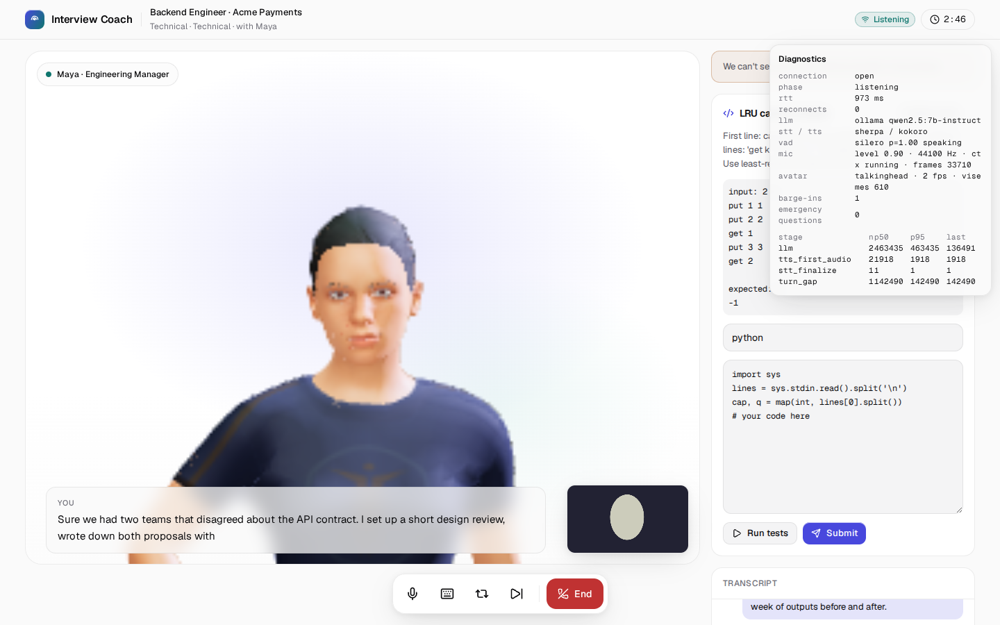
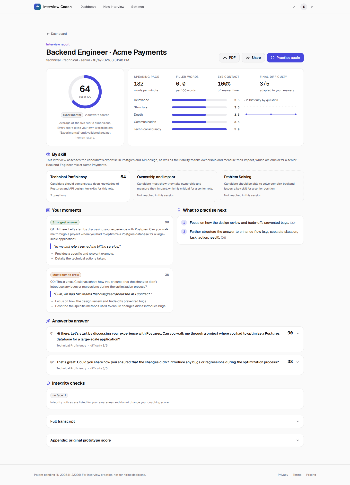

# AI Interview Coach

**Practise the interview before the interview.** An adaptive AI interviewer asks questions tailored to your role, seniority and resume, listens to your spoken answers, and gives feedback you can check: every score points to the words you said.

Patent pending (Indian application 202541122226). For candidates practising their own interviews, not for hiring decisions.

<!-- Real recordings from CI; see docs/evidence/e2e/README.md for how each was produced. -->
| Interview room (real LLM, spoken answers, barge-in) | Report (LLM rubric, quotes from the answer) |
|---|---|
|  |  |

Video: [`docs/evidence/e2e/real-llm/e2e-full-video-4x.webm`](docs/evidence/e2e/real-llm/e2e-full-video-4x.webm). This is a 4× time-lapse of a complete spoken interview with an open-weights 7B model running on a CPU-only CI machine.

## What it does

- **A live, spoken interview.**
  - You talk; it listens. Captions appear while you speak.
  - The interviewer answers in a natural neural voice, through a 3D avatar whose lips follow the audio.
  - You can interrupt it mid-sentence.
  - It runs in Chrome, Edge, Firefox, Safari and on mobile, and every one of those is tested in CI.
- **An interviewer, not a question bank.**
  - An LLM plans the interview from your role, seniority, company style, resume, job description and the skills to probe.
  - It then writes every question live.
  - Follow-ups quote what you just said. Difficulty moves with your answers. Questions never repeat.
  - If no model is available, the interviewer asks clearly badged backup questions, never silently.
- **Feedback you can check.**
  - Relevance, structure (STAR), depth, communication and technical accuracy are scored by an LLM rubric.
  - Every judgement quotes your own words, and the quotes are machine-verified.
  - Pace, pauses, filler words and eye contact are measured, not guessed.
  - Scores are labelled **experimental** until validated against human raters.
- **Multimodal checks** (patented mechanisms):
  - face verification with a randomised liveness challenge
  - voice verification from prompted phrases
  - **lip-sync verification**: does the candidate's mouth movement match the speech over time?
  - gaze tracking
  - phone and second-person detection
  - coding challenges with hidden tests
- **Privacy by design:**
  - camera analysis runs in the browser
  - speech recognition and synthesis run on your own server (no cloud speech service needed)
  - biometrics are stored only as encrypted templates
  - resume contact details are removed before any AI processing
  - one-click export and deletion
  - no emotion or personality inference, ever
- **Business-ready:** subscriptions (Stripe, Razorpay), plan limits and per-session cost caps, B2B seats, an admin dashboard, observability, and infrastructure as code.

## Sample interviews

Three of the 20 real-LLM mock interviews in [`docs/evidence/questions/`](docs/evidence/questions/), excerpted (the first three questions and the answers between them). The interviewer is an open-weights 7B model (Qwen2.5-7B-Instruct); the candidate is simulated by the same model from a profile. No question comes from a bank: each follow-up quotes and asks about the answer before it.

**Frontend Engineer (mid) at Vercel**: technical interview, 15 min, simulated candidate whose answers go up and down in quality. [Full transcript](docs/evidence/questions/interview-08.md)

> **Interviewer** (open): Hi there, thanks for joining us. I'm Maya. Can you tell me about your experience with React and how you've used it in a previous project?
>
> **Candidate**: Sure, Maya. In my previous role at Acme Corp, I worked on a project that involved building a robust dashboard for managing user accounts. I chose React for this project because of its component-based architecture and its ability to manage complex UIs …
>
> **Interviewer** (follow_up): That’s great to hear about your experience with React, especially the performance optimization. Could you walk me through the process you used to implement code splitting and lazy loading in that project? How did you determine which components needed to be split?
>
> **Candidate**: Sure, Maya. We faced some performance issues, so we decided to use code splitting and lazy loading. We split the components based on their usage. Not all components were needed on every page, so we kept them separate. For lazy loading, we used React's …
>
> **Interviewer** (challenge): I see, and you mentioned it was a mix of optimizations. Could you quantify the impact of code splitting and lazy loading? How did you verify that these changes led to a 30% reduction in initial load time?
>
> **Candidate**: Absolutely, Maya. We tracked the initial load times using Lighthouse in our browser's DevTools. Before implementing code splitting and lazy loading, the initial load time was around 1.2 seconds. After we made the changes, the load time dropped to …

**Product Manager (mid) at Atlassian**: behavioral interview, 15 min, simulated average candidate. [Full transcript](docs/evidence/questions/interview-03.md)

> **Interviewer** (open): Hi, thank you for joining us today. Let's start with a few questions to understand your experience with owning a product feature and your approach to customer engagement. Can you tell me about a time when you were responsible for owning a product feature, what was the feature, and what was your initial goal?
>
> **Candidate**: Sure, I can share that experience. At my previous role, I was part of the team that owned the project management features in our collaboration tool. My initial goal was to enhance the task tracking functionality to make it more intuitive for our users. We …
>
> **Interviewer** (follow_up): That's great to hear. Can you elaborate on the specific actions you took to streamline the workflow and how you ensured that the 25% increase in user satisfaction was achieved?
>
> **Candidate**: Sure, to streamline the workflow, we first conducted a user feedback session to understand pain points. We then reorganized the task layout to group similar tasks together and added clear labels. We also introduced a drag-and-drop feature to make moving tasks …
>
> **Interviewer** (follow_up): That's excellent. Can you provide more details on the specific metrics you used to measure the success of the improvements? Were there any trade-offs or challenges you faced during this process?
>
> **Candidate**: Absolutely. We focused on a few key metrics: task completion time, user engagement, and the number of support tickets related to task management. We saw a 20% reduction in task completion time and a 30% increase in user engagement. Regarding challenges, we …

**Registered Nurse (mid) at Apollo Hospitals**: mixed interview, 12 min, simulated average candidate. [Full transcript](docs/evidence/questions/interview-07.md)

> **Interviewer** (open): Can you tell me about a time when you provided exceptional patient care?
>
> **Candidate**: Sure. One time, a patient was experiencing severe anxiety and was having trouble breathing. I noticed she was struggling to catch her breath, so I immediately offered her reassurance and guided her through some breathing exercises. I also called the nurse on …
>
> **Interviewer** (follow_up): That's a great example. Could you tell me more about the patient's condition before you intervened? What specific symptoms were you observing, and how did the patient's condition change after you provided those breathing exercises?
>
> **Candidate**: Absolutely. Before I intervened, the patient was visibly very anxious and was having difficulty catching her breath. Her skin was pale, and she was hyperventilating. After I guided her through some breathing exercises and provided an oxygen mask, her …
>
> **Interviewer** (follow_up): That sounds like a challenging situation. Could you describe more about what the patient's breathing looked like before and after the breathing exercises? Also, did the patient mention any specific reasons for her anxiety, and how did you address those?
>
> **Candidate**: Before the breathing exercises, the patient was really struggling to breathe. She was gulping for air, and her chest was moving rapidly. After a few minutes of guided breathing exercises, her breathing slowed down, and she seemed to be more composed. She …

## Quick start (local)

```bash
cp .env.example .env
python -c "import os,base64;print(base64.b64encode(os.urandom(32)).decode())"   # paste into TEMPLATE_KEK_BASE64
docker compose up --build          # web on :3000, API on :8000; speech models download on first start
```

Without Docker:

```bash
uv sync --all-packages                                   # Python 3.11+
uv run python -m interview_core.realtime.assets download # local speech models (~1.7 GB, checksum-verified)
TEMPLATE_KEK_BASE64=... uv run uvicorn interview_api.main:app --reload --port 8000
cd apps/web && npm ci && API_BASE_URL=http://localhost:8000 npm run dev
```

**Choosing an LLM.** Set `LLM_PROVIDER` in `.env`, then follow the options in `.env.example`:
- a hosted model, through its API key;
- an OpenAI-compatible server;
- a local Ollama model, for example `qwen2.5:7b-instruct`. Running `docker compose --profile local-llm up --build` with `LLM_PROVIDER=ollama` starts one for you.

Without one, the interview still runs end to end, but with clearly badged backup questions and offline scoring. Face and voice verification need licensed models (see `.env.example`).

## Quality gates

```bash
make check        # secret scan, ruff, Python tests (core + API, incl. real speech models when installed)
make web-test     # eslint, typecheck, vitest
make e2e          # Playwright: the full spoken interview through a fake microphone
make eval         # evaluation harness -> docs/EVAL_REPORT.md, then: uv run python -m eval_harness gate
```

CI runs these on every push. It also runs:
- the spoken E2E on Chromium, Firefox, WebKit, Edge, mobile Chrome and mobile Safari;
- the same E2E against a real open-weights LLM;
- 20 mock interviews with that LLM (`.github/workflows/agent-evidence.yml`), whose transcripts are in [`docs/evidence/questions/`](docs/evidence/questions/).

Accuracy numbers are published **only** in [`docs/EVAL_REPORT.md`](docs/EVAL_REPORT.md), and only when measured on a real, consented dataset. Today every suite reads "not measured"; see [`eval/DATA_COLLECTION.md`](eval/DATA_COLLECTION.md) for what to collect.

## Repository

| Path | |
|---|---|
| `apps/web` | Next.js app (Vercel) |
| `services/api` | FastAPI service (Cloud Run) |
| `packages/core` | Patented algorithms, pure and tested; `legacy/` sub-package reproduces the prototype exactly |
| `eval` | Evaluation harness and regression gate |
| `infra/terraform` | GCP and Vercel infrastructure |
| `legacy/` | Original research prototypes (frozen, not shipped) |

## Documentation

- [Plan](docs/PLAN.md), [Claim map](docs/CLAIM_MAP.md), [Architecture](docs/ARCHITECTURE.md), [Decisions](docs/DECISIONS.md), [Design](docs/DESIGN.md), [Truth report](docs/TRUTH_REPORT.md)
- [Evaluation report](docs/EVAL_REPORT.md), [Load test](docs/LOAD_TEST.md), [Rubric](docs/RUBRIC.md)
- [Compliance](COMPLIANCE.md), [Model cards](MODEL_CARDS/), [Privacy notice draft](docs/legal/privacy-policy-draft.md)
- [Licence decision](docs/LICENSE_DECISION.md): no licence has been chosen yet; owner decision pending.

## Credits

Based on research by Dr. Kopperundevi N, Patel Kashyap Kalpeshkumar, Goditi Nishanth Sai Ram and Danaboina Venkata Prabhave (Vellore Institute of Technology), ICCCNT 2025.
