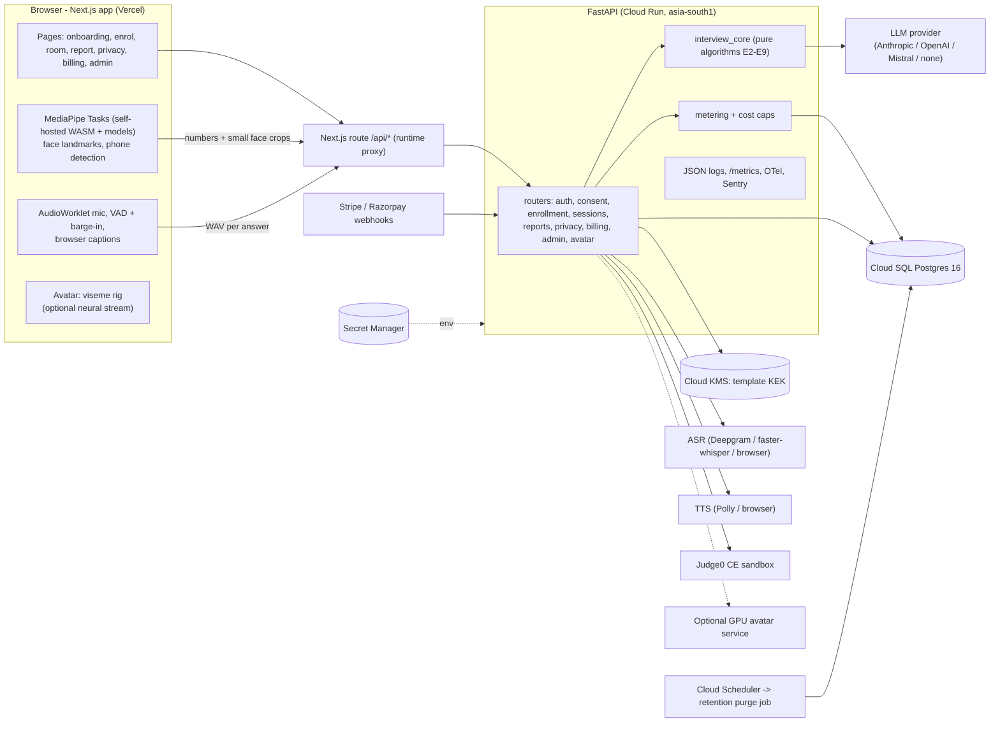

# Architecture

This document describes the system as built (milestones M0–M8). Differences from `docs/PLAN.md` are listed at the end.

## Packages

| Path | What | Licence of what it uses |
|---|---|---|
| `packages/core` (`interview_core`) | Pure algorithms for every patent element, plus provider adapters. No web or database code. | numpy, jsonschema, pypdf, httpx, cryptography (all permissive). Model backends are optional extras. |
| `services/api` (`interview_api`) | FastAPI service: auth, consent, enrolment, sessions, reports, privacy, billing, admin, metrics. SQLAlchemy with Alembic migrations. | FastAPI, SQLAlchemy, argon2-cffi, Pillow, prometheus-client |
| `apps/web` | Next.js 16 / React 19 client. Same-origin proxy to the API. | MediaPipe Tasks (Apache-2.0) |
| `eval` (`eval_harness`) | One-command evaluation harness, regression gate, smoke data | - |
| `legacy/` | Frozen prototypes (reference only, not shipped) | contains AGPL / non-commercial weights; not used by product code |
| `infra/terraform` | GCP (Cloud Run, Cloud SQL, KMS, Secret Manager, Scheduler) and Vercel | - |
| `loadtest/` | Concurrent full-session load test | - |

## A session, end to end

1. **E1:** the candidate enters role, seniority, optional job description and resume PDF. The API extracts text with pypdf, **removes contact details**, and stores only a redacted context in the session state.
2. **E6:** `/sessions/{id}/next` asks the `Interviewer` for a question. The configured LLM returns JSON constrained to `question.v1`. `StructuredLLM` validates it, rejects repeats and wrong category or difficulty, makes one repair attempt, then falls back to the question bank. Nothing unvalidated reaches the client. If the session's cost cap is reached, the bank is used.
3. **Interviewer voice:** server TTS (Polly, with viseme marks) on paid plans, otherwise browser speech synthesis with word-boundary visemes. The avatar rig animates from the viseme timeline and reports `question_to_first_avatar_frame`.
4. **Answer:** the browser records the answer (AudioWorklet). VAD ends the turn after 1.2 s of silence; speaking over the interviewer stops it (barge-in). It also collects the mouth-aperture series (E4) and on-screen samples (E5) at 12 fps, plus captions or a typed answer.
5. `/sessions/{id}/answer`:
   - server ASR if configured (word timings feed the delivery metrics)
   - **E4** `verify_av_sync` on audio plus mouth series
   - **E3** per-utterance voice match if enrolled
   - **E5** gaze summary
   - **E6** evidence-verified rubric evaluation
   - difficulty adapts by one step; a follow-up is asked when the evaluation requests one
6. **E7:** face count and phone detections are batched every 2 s to `/events`. The integrity policy debounces them. Coaching mode only shows notices; proctored mode ends the session at per-type limits.
7. **E2:** if enrolled and configured, a face crop is verified against the encrypted template every 45 s.
8. **E8:** technical roles get one coding challenge with hidden tests, run in Judge0 (or step-limited SQLite for SQL).
9. **E9:** `/finish` builds the report: rubric scores with quotes, delivery and gaze observations with timestamps, integrity notes (kept separate from the score in coaching mode), code results, and the prototype nine-factor score as an appendix. Reports can be shared through revocable, expiring links.

## Data protection boundaries

- **Video never leaves the browser.** Landmark maths runs on-device. Only numbers are sent, plus small face crops for enrolment and periodic verification (decoded in memory, embedded, discarded).
- **Audio:** each answer's WAV is processed in memory (ASR, voice match, lip-sync) and not stored (`RAW_MEDIA_RETENTION_DAYS=0`).
- **Biometric templates:**
  - AES-256-GCM with a per-template data key, wrapped by a KEK in Cloud KMS
  - associated data binds each blob to owner, kind and model
  - retention-limited, and deleted when consent is withdrawn or the account is deleted
- **Logs:** a redaction filter masks credentials, emails and phone numbers. Request bodies are never logged.
- **Consent:** per purpose, versioned, latest record wins, enforced server-side for each action.

## Configuration and degradation

`GET /ready` and every session response include `capabilities`. The client uses them to say what is and isn't available.

| Missing | Behaviour |
|---|---|
| LLM | Deterministic question bank; heuristic feedback labelled "automatic" |
| Face or voice model or threshold | Enrolment returns 503; checks report `not_configured` |
| Server ASR | Browser captions or a typed answer; no word timings (delivery metrics "not measured") |
| Server TTS | Browser speech synthesis |
| Judge0 | SQL challenges still graded locally; other languages report "not configured" |
| Camera or vision models | Audio-only session; E4/E5/E7 signals "not measured" |
| Neural avatar | Viseme rig (always the fallback) |

## Code execution

General-purpose code runs only in a Judge0 CE sandbox (GPL-3.0, run as a separate service; its licence does not extend to this code). Deploy it with the upstream instructions on a dedicated VM (it needs privileged containers, so not Cloud Run) and set `JUDGE0_URL`. Language ids are pinned in `interview_core.codeexec.runner.LANGUAGE_IDS`.

## Deploy

1. `terraform -chdir=infra/terraform/gcp init -backend-config=bucket=<state-bucket>` and `apply`, using `terraform.tfvars` (see `.example`).
2. Add secret versions (database URL in the Cloud SQL socket form `postgresql+psycopg://USER:PASS@/interview?host=/cloudsql/<connection-name>`, LLM key, and so on).
3. Build and push `services/api/Dockerfile` to Artifact Registry. Set `api_image` and apply again.
4. `terraform -chdir=infra/terraform/vercel apply -var api_base_url=<api_url>`. Set `TRUSTED_PROXY_HOPS=2` on the API for the Vercel → Cloud Run topology.
5. Configure Stripe and Razorpay webhooks to `/api/billing/webhooks/{stripe,razorpay}`.

Local: `cp .env.example .env` (set `TEMPLATE_KEK_BASE64`), then `docker compose up --build`.

## Differences from PLAN.md

- **Realtime transport:** the plan proposed LiveKit. v1 uses per-turn HTTPS: VAD and barge-in run in the browser, and each answer is uploaded as one WAV. This is simpler to operate, works on Cloud Run, and meets the turn-latency budget measured in `docs/LOAD_TEST.md`. Server-side streaming ASR with partial results is **not implemented**; live captions come from the browser's speech recognition where available. Moving to LiveKit or WebSocket streaming is a contained change in the room page and a new API endpoint.
- **`packages/schemas`:** JSON Schemas live inside `interview_core/nlp/schemas/` (shipped as package data) rather than as a separate package.
- **Face embedding vendor:** only the ONNX adapter (bring a licensed model) is implemented. A vendor API adapter was not added, because it would store templates with the vendor and needs a separate decision.
