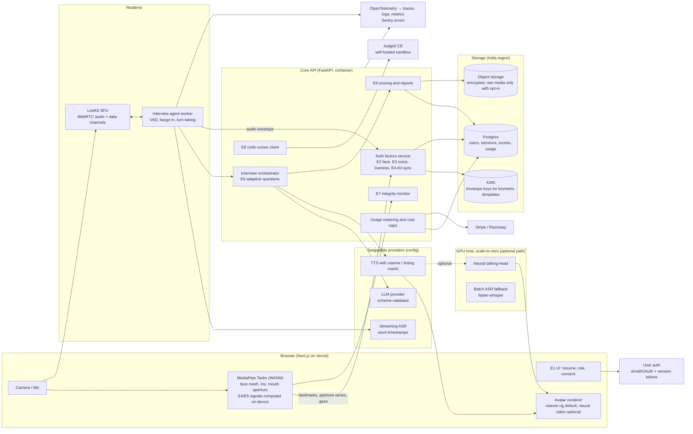

# Production Plan: AI Interview Coach (patent application 202541122226)

**Status:** awaiting owner approval. No code has been changed. Phase 2 starts only after an explicit "approved".
**Inputs:** both repos (read-only audit), the IP India abstract printout, the ICCCNT-2025 paper. See `docs/patent/SOURCES.md`.
**Biggest caveat:** the **claims have not been seen**. The Claim Map is built from the abstract's nine elements. Everything below is designed to stay inside that element list. It will be re-checked against the claims the moment they arrive (milestone M0 is blocked on nothing; M3 onward should not merge until the claims have been checked).

---

## 0. Findings that change the brief

1. **"Lip-sync" in the patent is candidate-side verification, not an avatar.** Abstract element 4 is "a lip-sync verification module for analyzing mouth movements and detecting speech authenticity mismatches". The paper cites lip-sync *deepfake detection* work (Bohacek & Farid; Liu et al.; Datta et al.). **A generative talking-avatar interviewer is not a patented mechanism.** It is a new product feature. I've planned it (M6) because it's good product, but it carries no claim-preservation constraint, and the patented E4 is what must become real.
2. **The patented lip-sync check currently never fires.** NG `verify_lip_sync` returns at least 0.8 and the caller warns only below 0.8. FT's version is `sleep(1.5)` followed by "Passed". This is the claim element furthest from IMPLEMENTED.
3. **VIT, not you, is the applicant.** There are three named inventors, and the paper has a fourth author. Selling a product under this patent needs an assignment or an exclusive licence from VIT, and possibly clarity on code ownership under VIT's IP policy. **This is the #1 commercial blocker. It needs a lawyer, not code.**
4. **The paper's numbers can't be reproduced from the repos.** There is no data, logs or scripts for n=87, 250+ sessions, 96.4% face, 5.8% WER, 94.2% lip-sync or 93% emotion. Several of them couldn't have come from the committed code: NG's lip-sync check can't fail, NG has no emotion module, and the text says the fifth language is Ruby while Table III says SQL. The README benchmark table (99.7%, 95.3% and so on) has the same problem. **Don't use any of these numbers in product or marketing copy.** Phase 3 produces numbers we can defend. If the 87-participant study data exists, and its consent forms allow reuse, it is the most valuable asset for this plan. Please locate it.
5. **The committed report PDFs and resumes are synthetic** (`generate_reports.py`, random scores and names), and the live report pads missing data with `random.uniform` (NG L1647–1676).
6. **Two live credentials are in public git history** (Mistral key in NG; RapidAPI/Judge0 key in both). Rotate them. The fix in code is M0.
7. **Baseline:** zero tests and zero CI in either repo. Syntax compile: NG 4/4 files, FT 9/11 (`chatGPT.py` syntax error; `fix.py` is UTF-16). NG `requirements.txt` doesn't resolve on Python 3.11 (`mediapipe==0.10.3` is unavailable). The apps need a webcam, mic and display, so they weren't run. **The regression reference is therefore the claim behaviours themselves.** M1 turns them into characterization tests before anything is changed.

---

## a) Claim Map (summary)

Full table with file and line ranges: **`docs/CLAIM_MAP.md`**.

| # | Abstract element | Best current code | Status | Gap to close |
|---|---|---|---|---|
| E1 | UI: candidate info and job role | NG Tkinter `main_app` | IMPLEMENTED (desktop) | Web UI and accounts |
| E2 | Facial recognition: capture samples and verify identity | FT InsightFace (non-commercial weights); NG histogram correlation | IMPLEMENTED (FT) / PARTIAL (NG) | Licensed embedding, liveness, calibrated threshold |
| E3 | Voice auth: reference and real-time matching | NG pyannote/MFCC; FT Resemblyzer | IMPLEMENTED | Enrolment-bypass bug, calibrated threshold, replay and spoof detection |
| E4 | **Lip-sync verification** | NG one-frame mouth ratio (cannot fire); FT `sleep`+"Passed" | **STUBBED/MOCKED** | Real temporal audio-visual sync analysis |
| E5 | Eye tracking: gaze and engagement | NG MediaPipe iris, horizontal only | PARTIAL | Head pose, calibration, validation |
| E6 | NLP: resume parse, personalised questions, transformer-based evaluation | NG Mistral questions; numeric score is keyword heuristics | PARTIAL | Schema-validated LLM rubric scoring, adaptive difficulty |
| E7 | Security: unauthorised devices, assistance | NG YOLOv8 (AGPL), multi-face, background-audio RMS | IMPLEMENTED (heuristic) | Licensed detector, measured precision and recall |
| E8 | Coding challenges with feedback | NG Judge0 and in-process SQLite | IMPLEMENTED | Test-case grading, sandboxed SQL, no hard-coded key |
| E9 | Transcript analysis and reports | NG grading and PDF report | PARTIAL, ⚠ mocked series | Remove mock data, scores tied to transcript spans |

Also: avatar **MISSING** (not claimed). Emotion recognition exists in FT only (not claimed).

---

## b) Repo decision

**Decision: consolidate into `Next-Generation-Virtual-Interview-Training-System` as the monorepo, importing `futuristic-ai-interviewer` with full history via `git subtree add`.** This is option (i), done with a history-preserving import, so the result is the monorepo you asked for without creating a new GitHub repo.

Why:
- **Neither repo is ahead on everything.** NG matches the paper's stack (pyannote, Haar+DNN, ttkbootstrap, Mistral) and has the reports and integrations. FT is ahead on biometrics (InsightFace, Resemblyzer, registration-time lip-movement check) and structure (`interview_bot.py`, `face_processor.py`). Both are needed.
- **The two histories share no commits** (both are browser uploads), so a subtree import is clean and keeps every original commit reachable.
- **NG's name already fits the product.** Using it avoids creating a new public repo, which I won't do without your explicit go-ahead. If you'd rather have a fresh name, the same steps run against a new empty repo (option iii) with no other change.

Steps (M0):
1. `git mv` NG's current code to `legacy/desktop/`.
2. `git subtree add --prefix=legacy/futuristic <FT remote> main`.
3. Mark FT's README "moved". Archiving the FT repo on GitHub is your call.

Target layout:
```
apps/web/            Next.js client (Vercel)
services/api/        FastAPI: sessions, interviewer orchestration, auth factors, reports, billing webhooks
services/realtime/   LiveKit agent worker (ASR/TTS streaming, barge-in)
packages/core/       Pure-Python patented algorithms (E2–E9), no I/O, fully unit-tested
packages/schemas/    JSON Schemas shared by api and web (questions, evaluations, reports)
services/gpu/        Optional GPU workers (neural avatar, batch ASR) on scale-to-zero host
eval/                One-command evaluation harness and reports
infra/               IaC (Terraform), docker-compose for local dev
legacy/desktop/      Original NG app (kept runnable until parity)
legacy/futuristic/   Imported FT history
docs/                PLAN, CLAIM_MAP, ARCHITECTURE, EVAL_REPORT, patent/
```

---

## c) Target architecture



Key design choices:
- **Raw video stays on the device by default.** Face mesh, iris and mouth-aperture series (E4, E5) run in the browser via MediaPipe Tasks (Apache-2.0). Only numeric series are sent, plus the specific face crops that verification needs. This is cheaper (no GPU for vision), faster, and much stronger on privacy. Whether a claim requires these modules to run on a particular device can only be confirmed from the claims. Until then, the server-side path in `packages/core` stays available.
- **No GPU on the latency-critical path.** The default avatar is a viseme-driven rig fed by TTS viseme or timing marks, so "first avatar frame under 1.5 s" doesn't depend on GPU cold starts. The neural avatar is an upgrade path behind a flag, with the rig as the automatic fallback.
- **Every vendor sits behind an interface** (`LLMProvider`, `ASRProvider`, `TTSProvider`, `FaceEmbedder`, `SpeakerEmbedder`) selected by config.

---

## d) Component upgrades (each needs your approval; all stay within the abstract's wording)

"Expected gain" is a **target to be measured** against the Phase 3 eval set. Nothing here is a measured result.

| Element | Current method | Proposed upgrade | Target metric (to be measured) | Why it stays within the element |
|---|---|---|---|---|
| **E2** Face | NG: grayscale-histogram correlation. FT: InsightFace `buffalo_l` (non-commercial) | 1) Multi-sample enrolment (kept) produces a deep face **embedding template** (commercially licensed model: a licensed InsightFace commercial model, or a vendor such as AWS Rekognition, see §f). 2) Cosine match with **threshold calibrated on the eval set**. 3) **Liveness:** active challenge (blink or head turn from MediaPipe landmarks) plus passive presentation-attack detection. 4) Periodic re-verification during the session (kept from FT). | FAR ≤ 0.1% at FRR ≤ 3%. PAD APCER and BPCER ≤ 5% on print and screen-replay attacks. Gaps by subgroup reported. | Still "capturing facial samples and verifying candidate identity". Liveness is additive hardening. |
| **E3** Voice | Resemblyzer / pyannote, fixed 0.8 threshold, enrolment-bypass bug | 1) Prompted reference recording (kept). 2) ECAPA-TDNN speaker embedding (SpeechBrain, Apache-2.0; verify the model card) behind `SpeakerEmbedder`. 3) Calibrated threshold, scored per utterance during answers (**real-time matching kept**). 4) Replay and synthetic-speech countermeasure (trained spoof detector, license-checked) replacing the spectral-flatness heuristic. 5) Fix the bypass: no reference means no matching, and a "not enrolled" status. | Speaker-verification EER ≤ 5% in-domain (Indian-English set). Spoof-detection EER reported. | Same element: reference recording plus real-time matching. |
| **E4** Lip-sync verification | Single-frame mouth ratio, floored at 0.8 (cannot fire). FT: `sleep` + "Passed" | **Stage 1 (no training data needed):** time-aligned **mouth-aperture series** (MediaPipe lip landmarks, ~30 fps) cross-correlated with the **speech energy envelope and VAD** over each utterance. Searching for the lag gives a sync score and an audio/video offset. The check flags (a) speech with no matching mouth motion, (b) a lag outside ±200 ms, (c) mouth motion with no speech. **Stage 2:** learned audio-visual sync model (SyncNet-style embedding distance), trained only on commercially licensable, consented data. LRS2/LRS3 are **non-commercial** and can't be used. | Separating genuine vs constructed mismatch (other-speaker audio, playback, offset audio): AUC ≥ 0.95, EER reported. Offset error ≤ 80 ms. | This is literally "analysing mouth movements and detecting speech authenticity mismatches", now done over time and actually able to fire. |
| **E5** Eye tracking | Iris-to-eye-corner horizontal ratio, ±0.20 | Iris ratio (kept) plus head pose (solvePnP on mesh), vertical gaze, short per-user calibration, smoothing. Output is **observable behaviour** ("looked away from the screen 40% of answer 3"). No "nervous" or "engaged" judgement shown to the user. | Frame-level on-screen vs off-screen agreement with human annotation: Cohen's κ ≥ 0.6. Subgroups including glasses. | Same element: gaze direction and engagement level as a measured quantity. |
| **E6** NLP | PyMuPDF text dump, Mistral prompt with no schema, random fallback. Score = keyword heuristics | 1) Resume parsing with pypdf / pdfminer.six (permissive licences) and a structured résumé schema. 2) `LLMProvider` abstraction (Mistral, Anthropic, OpenAI, chosen by config). JSON-Schema outputs, validation, retries, timeouts, and a deterministic **question bank fallback**, so nothing unvalidated reaches the UI. 3) Adaptive difficulty: each answer's rubric score moves a level (IRT-style ±1 step) and conditions the next question on role, seniority, résumé/JD and history. 4) **Evaluation by a transformer** (rubric-scored LLM with cited transcript spans). The existing 9-factor breakdown is kept as explainable features. | Schema-valid output rate ≥ 98% raw, 100% at the UI (by construction). Question relevance: expert-rated κ reported. Answer-score agreement: Spearman ≥ 0.6 and QWK ≥ 0.6 with human raters, otherwise labelled "experimental". | Same parse, generate and evaluate steps. "Using transformer-based models" becomes true for scoring too (today it's heuristic). |
| **E7** Security / integrity | YOLOv8n (AGPL) "cell phone". More than one face fails. Background-audio RMS | Permissively licensed detector (MediaPipe Object Detector EfficientDet-Lite, Apache-2.0, or another permissive alternative) for phones and other devices. Multi-person check (kept). Second-speaker detection from the speaker-embedding stream. Separate counters per warning type, with configurable policies (coaching mode: inform only; B2B mode: per-tenant policy). | Device detection precision and recall on annotated frames. False-alarm rate per session. | Same element: detecting devices and preventing assistance. |
| **E8** Technical assessment | Judge0 via RapidAPI with a hard-coded key. In-process SQLite. LLM prose feedback | Self-hosted Judge0 CE (GPL-3.0, run as a separate service) or a paid hosted plan. **Hidden test cases** for pass/fail. SQL runs in the sandbox too. Feedback = test results plus LLM review tied to code lines. | Run latency p50/p95. Correctness of verdicts vs reference solutions = 100% on the challenge bank. | Same element: present challenges and provide feedback. |
| **E9** Performance evaluation | Heuristic score, PDF with **random-filled series** | Remove all mock data (a missing signal is shown as "not measured"). Every score links to transcript spans or timestamps. Delivery metrics from ASR word timings (pace, pauses, fillers). Uncalibrated scores badged "experimental". Shareable web report plus PDF (permissively licensed generator). | Report-generation success rate. Score calibration as in E6. | Same element: analyse transcripts and generate comprehensive reports. |
| (not claimed) Avatar | GIF of a circle | **v1:** 2D/3D rig driven by TTS viseme marks (Azure Speech viseme events or Amazon Polly speech marks; Rhubarb Lip Sync (MIT) as an offline fallback) with an avatar asset you own outright. **v2 (flag):** neural talking head on a GPU host, commercial licence only (Wav2Lip and SadTalker-class research weights are excluded). Automatic fallback from v2 to v1 to audio-only. | Question text to first avatar frame: p95 < 1.5 s. LSE-D / LSE-C (SyncNet) for v2 and the rig. | Not a claim element. No constraint. |
| (not claimed) Emotion | FT DeepFace emotion | **Remove from the product.** Keep only observable-behaviour signals. | n/a | Not in the abstract. Also see §f (EU AI Act). If the claims turn out to include it, I'll come back to you before removing anything. |

---

## e) Evaluation plan (Phase 3)

One command, `make eval` (or `python -m eval run --suite all`), writes `docs/EVAL_REPORT.md` and a JSON artifact. Synthetic data is used **only for smoke tests**. Every accuracy figure comes from the real, consented sets below.

| Metric | Data needed (minimum to start; more is better) | Consent and format |
|---|---|---|
| Face FAR/FRR/EER, by subgroup | ≥ 100 subjects (aim for 300). Per subject: 1 enrolment session (15 frames) plus ≥ 10 probe captures across 2 lighting conditions and ≥ 2 devices, with and without glasses. Self-reported age band and gender, Monk skin-tone scale (optional). | Written biometric consent naming the purpose (evaluation), retention period and deletion right. Format: JPEG crops plus JSON metadata. |
| Liveness APCER/BPCER (ISO/IEC 30107-3 style) | ≥ 50 subjects × {printed photo, phone-screen replay, laptop-screen video replay}, plus bona-fide captures | As above. Attack media made from the subject's own consented images. |
| Voice EER, spoof EER, by accent | ≥ 100 speakers (mostly Indian-English, across regions), 3 sessions, ≥ 2 devices, prompted plus free speech, ≥ 3 min each. Replay recordings plus TTS-clone attacks made **only from consented speakers' own voices**. | Voice-biometric consent. 16 kHz mono WAV plus JSON. |
| Lip-sync verification AUC/EER, offset error | Genuine: ≥ 100 subjects × 5 clips (10–20 s, face plus audio). Constructed negatives: swapped-speaker audio, ±(100–500 ms) offsets, playback-while-silent. Labelled as constructed. | Audio-video consent. MP4 plus landmark JSON. |
| Gaze κ, precision/recall | ≥ 30 subjects × 2 min of interview-style video, frame-level on/off-screen annotation by 2 annotators | Video consent. |
| Device and second-person detection | ≥ 500 annotated frames from consented sessions (phone visible, partly visible, absent; second person present or absent) | Video consent. COCO-format boxes. |
| ASR WER (overall and per accent) | ≥ 2 h of interview-style answers, ≥ 50 speakers, human transcripts. Public Indian-English sets (for example AI4Bharat Svarah; check its licence first) as a secondary sanity set. | Voice consent. WAV plus reference text. |
| Question relevance | 200 generated questions from ≥ 40 real (consented, de-identified) résumé/JD pairs × 3 expert raters | Résumé consent and de-identification. |
| Answer-score agreement (Spearman, QWK), by subgroup | ≥ 300 answers (≥ 60 candidates) each rated by ≥ 3 trained raters on the published rubric | Candidate consent to human rating. |
| LLM schema-validity rate | Every LLM call in the eval and E2E runs (automatic) | n/a |
| Latency p50/p95 | Instrumented E2E sessions: question to first audio byte, first avatar frame, end-of-speech to final transcript, end-of-answer to next question | n/a |
| Avatar LSE-D/LSE-C | 100 generated avatar clips per avatar path | n/a |
| Load | k6/Locust plus LiveKit load tester: 25, 100 and 250 concurrent synthetic sessions (smoke data is fine here) | n/a |

If the study participants consented to reuse, the paper's 87-participant data may cover part of this. If collection goes through VIT, its ethics committee approval is the cleanest route.

**Regression gate (CI):**
- Every baseline and characterization test still passes.
- No metric regresses by more than the agreed tolerance (proposed: face/voice EER +0.5 pt, WER +1 pt, latency p95 +10%).
- No Claim Map row moves away from IMPLEMENTED.

---

## f) Commercial blockers

| # | Blocker | Severity | Resolution |
|---|---|---|---|
| 1 | **Patent owned by VIT**, with three inventors (four paper authors) | Blocks selling | Lawyer: assignment or exclusive licence from VIT, plus inventor agreements. Check VIT's policy on student-created software. |
| 2 | Patent published, **not granted** | Marketing wording | Use "patent pending". Confirm the examination request (Form 18) is filed. |
| 3 | **YOLOv8n weights: AGPL-3.0** | Blocks closed SaaS | Replace with an Apache/MIT detector (E7) or buy an Ultralytics Enterprise licence. |
| 4 | **InsightFace `buffalo_l` and other model-zoo weights: non-commercial** | Blocks selling | Buy an InsightFace commercial licence, use a vendor API, or train on commercially licensed data. |
| 5 | **PyMuPDF: AGPL-3.0** | Blocks closed SaaS | Switch to pypdf / pdfminer.six (E6). |
| 6 | **Google Web Speech endpoint** (`recognize_google`): not licensed for production | Blocks selling | Licensed streaming ASR vendor, or self-hosted faster-whisper (MIT). |
| 7 | DeepFace emotion and VGG-Face weights, res10 SSD caffemodel: licence/provenance unclear | Risk | Remove emotion. Replace res10 with the MediaPipe detector. |
| 8 | Wav2Lip / SadTalker-class weights, LRS2/LRS3 data: non-commercial | Constrains avatar and E4 Stage 2 | Excluded by design. |
| 9 | Leaked Mistral and RapidAPI keys in public history | Security | Rotate now (owner). Move to env in M0. History rewrite is optional and needs your separate yes. |
| 10 | Synthetic reports and resumes in the repo; unsubstantiated accuracy figures in README and paper | Misleading-claims risk | M0 removes them from the tree and README. Marketing uses only `EVAL_REPORT.md` numbers. |
| 11 | Real session data in the repo (your session logs and reports; FT `temp/*.wav` voice clips) | Privacy | M0 removes them from the tree. History purge on your yes. |
| 12 | **EU AI Act:** recruitment AI is high-risk (Annex III). Emotion recognition in workplaces **and education institutions** is prohibited (Art. 5(1)(f)). Selling to universities or placement cells counts as education. | Regulatory | Emotion removed from every mode. B2B hiring and screening goes behind a feature flag (off) until a conformity plan exists. Lawyer review. |
| 13 | India DPDP Act 2023 and Rules: consent notices, purpose limitation, erasure, breach reporting | Regulatory | Consent flows, retention config, deletion API, breach runbook in Phase 4. Biometrics treated as sensitive as a policy choice. Lawyer to confirm the current Rules timeline. |
| 14 | Cost per session (see below) | Margin | Hard per-session caps, metering from day one. |

**Cost per session** is measured in M7, not estimated here, because vendor prices change. The meter records:

`C = LLM_in_tok·p_in + LLM_out_tok·p_out + ASR_min·p_asr + TTS_chars·p_tts + GPU_s·p_gpu + code_runs·p_run + egress_GB·p_bw`

The free tier enforces a hard cap on `C` per session and per month. The admin view shows the per-session breakdown.

**GPU host proposal:** Modal or RunPod Serverless (scale to zero, per-second billing). These are used only for the optional neural avatar and batch ASR, so cold starts never touch the 1.5 s target.

---

## g) Milestones

Each milestone is one branch and one PR, independently shippable and testable. The handoff line follows the format you specified.

| M | Scope | Ships | Done when |
|---|---|---|---|
| **M0 Hygiene and monorepo** | Subtree import of FT. Move NG to `legacy/desktop`. Secrets to env, plus `.env.example`. `.gitignore`. Remove synthetic reports and resumes, session logs and recordings from the tree. Remove unmeasured numbers from README. CI (ruff, compile, pytest). Fix the FT syntax error and UTF-16 file in the legacy copy. | Clean, safe repo | CI green. Secret scan clean on HEAD. Legacy app starts in an environment with pinned dependencies. |
| **M1 Core extraction plus characterization tests** | Move E2–E9 algorithms into `packages/core` with **behaviour-preserving** refactors. The legacy app calls `core`. Unit and characterization tests pin current behaviour (including the bugs, marked xfail where we intend to fix them). | Testable patented core | Every Claim Map row points to `packages/core`. Tests pass. |
| **M2 Eval harness plus data protocol** | `eval/` runner and report. Consent forms (draft). Data-collection capture tool. Smoke suites on synthetic data. **Baseline numbers** wherever real data exists. | Measurement before change | `make eval` runs. Baseline written to `EVAL_REPORT.md` (or "no data yet" per metric). |
| **M3 Authentication** | E2 licensed embedding plus liveness. E3 ECAPA plus calibrated threshold plus bypass fix plus spoof countermeasure. **E4 Stage 1 temporal AV-sync**. Encrypted templates with retention and deletion. | Real multimodal auth | FAR/FRR/EER, APCER/BPCER and E4 AUC reported before vs after. E4 moves to IMPLEMENTED. |
| **M4 Interviewer and speech** | `LLMProvider`, schemas, retries, fallback bank, adaptive difficulty. Streaming ASR with word timestamps, VAD, barge-in. TTS provider with viseme marks. | Reliable conversation engine | Schema validity, WER and latency reported. 100% validated outputs at the UI. |
| **M5 Web platform MVP** | Next.js, FastAPI and LiveKit. Browser MediaPipe (E4/E5 signals). Accounts. Consent flows. E7 and E8 in the web app. Full session E2E test. | Usable product (coaching mode) | Playwright E2E for a full session passes. Legacy parity checklist complete. |
| **M6 Avatar** | Viseme rig, automatic degradation, latency instrumentation. Neural avatar behind a flag (if a licensed option is chosen). | Interviewer avatar | First-frame p95 < 1.5 s measured. LSE-D/C reported. |
| **M7 Analysis, reports, billing** | E9 explainable scores and delivery metrics. Shareable reports. Stripe and Razorpay. Metering, caps, admin cost view. Rate limits. | Revenue-ready | Cost per session measured. Billing tests in sandbox mode. |
| **M8 Ops** | OpenTelemetry traces, Sentry, dashboards, Terraform, `docker compose up` dev, load test. | Production deploy | Load test report. Rollback documented. |
| **M9 Compliance pack** | `COMPLIANCE.md`, privacy policy draft, model cards, data retention config, B2B flag documentation, final README. | Launch readiness | Lawyer-review list delivered (not legal advice). |

---

## Decisions I made as delegated (say so if you disagree)

1. Monorepo inside NG, with FT imported with full history (§b).
2. Avatar treated as a new, non-claimed feature. The viseme rig comes first, the neural avatar is optional.
3. Emotion inference removed from the product.
4. On-device vision signals by default.
5. Coaching mode is v1. B2B hiring sits behind an off-by-default flag.
6. No licence file is added to the repo until you decide. A patented commercial product usually shouldn't be open-sourced under a permissive licence, so this is your call (plus VIT's).

## What I need to proceed

- **To start M0–M2 (no claim risk): your "approved".** Note any edits to §b–§g.
- **Before M3 merges:** the filed **claims** (from the IP India "View Documents" page or VIT's IPR cell).
- **Two yes/no answers:**
  - (a) Purge leaked keys and personal recordings from git **history** (a force-push that rewrites history)?
  - (b) May I archive `futuristic-ai-interviewer` on GitHub after the import?
- **One lookup:** does the paper's 87-participant study data exist, and what did participants consent to?
- **Vendor and budget preferences, if any** (LLM, ASR/TTS vendor, face model licence vs API). Otherwise I'll pick by measured quality per rupee in M2–M4 and report the trade-off.
